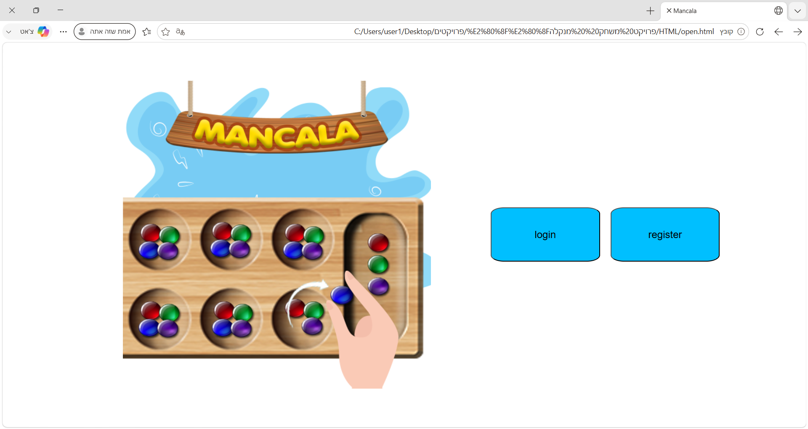
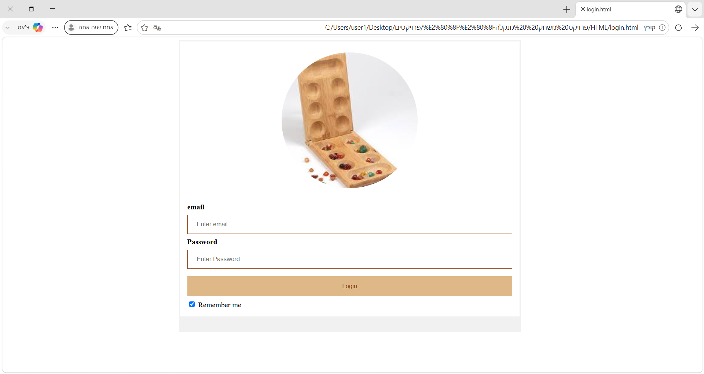
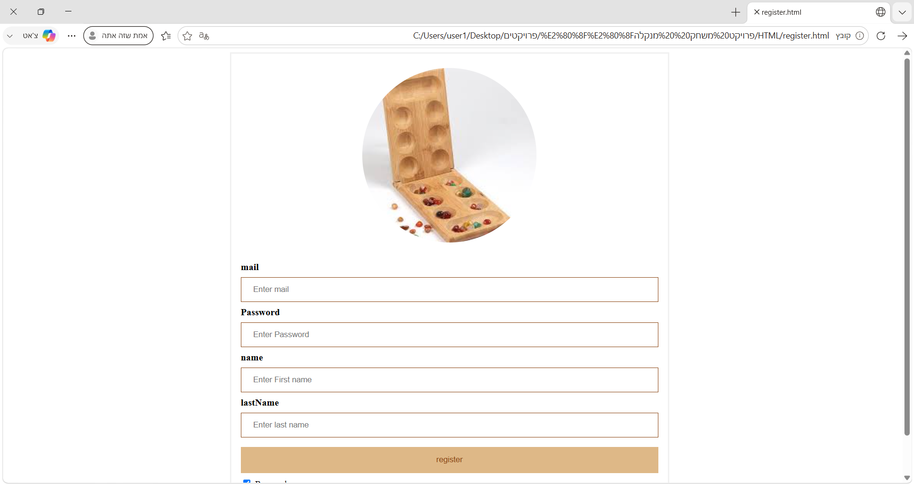
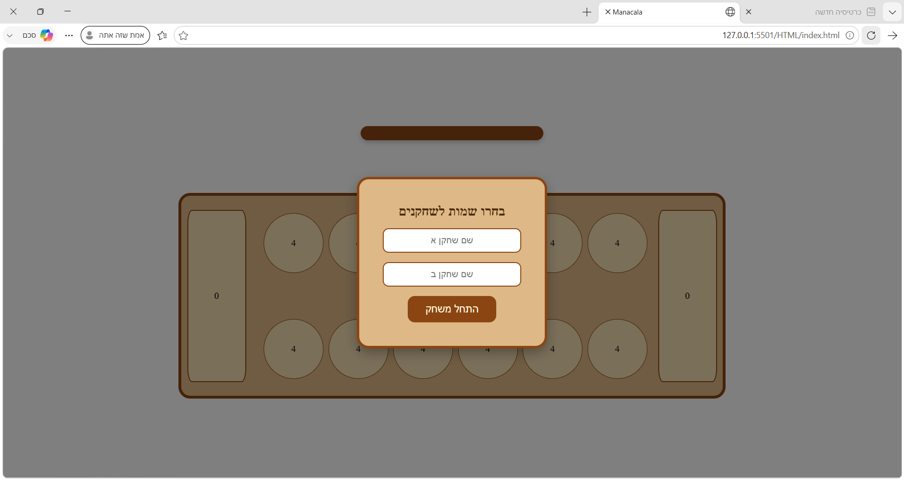
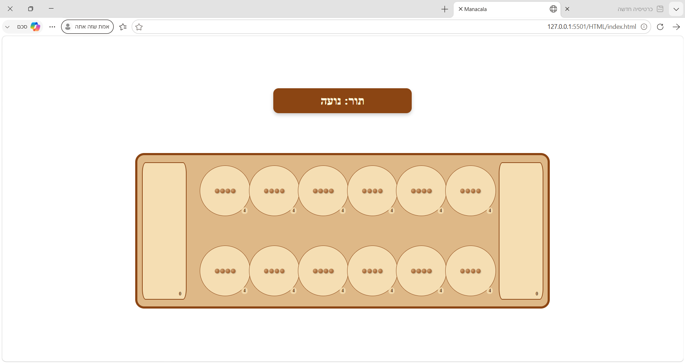

# Mancala Game

A classic **Mancala** board game built with vanilla HTML, CSS, and JavaScript.  
This is a two-player game played entirely in the browser — no server or database required.

## Features

- **Two-player gameplay** — take turns scooping and sowing seeds
- **Full game logic** — including capture rules, extra turns, and game-end detection
- **User accounts** — register and login (stored in `localStorage`)
- **Polished UI** — wooden-style board, smooth messages, Hebrew & English prompts

## Rules

1. Each pit starts with 4 stones.
2. On your turn, pick a pit on your side, pick up all stones, and drop one stone in each pit counter-clockwise.
3. **Skip the opponent's store** — only your own store collects stones.
4. If your last stone lands in your store → you get **another turn**.
5. If your last stone lands in a **non-empty pit**, you pick up all stones from that pit and continue distributing until you land in an **empty pit** → then your turn ends.
6. You may only pick stones from pits on your own side — unless you have no stones left.
7. The game ends when one side is empty. The remaining stones go to the other player's store. **Highest total wins.**

## How to Run

1. Open the project folder in **VS Code**
2. Install the **Live Server** extension
3. Right-click `HTML/open.html` → **"Open with Live Server"**

Or simply open `HTML/open.html` directly in your browser (CSS paths work both ways).

## Project Structure

```
├── HTML/          # Pages (open, login, register, index, start, result)
├── CSS/           # Stylesheets per page
├── JS/            # Game logic + auth
├── IMAGES/        # Board images & screenshots
└── README.md
```

## Screenshots

| Open Screen | Login |
|:---:|:---:|
|  |  |

| Register | Choose Names |
|:---:|:---:|
|  |  |

| Game Board |
|:---:|
|  |

## Tech Stack

- **HTML5**
- **CSS3** (Grid, Flexbox, custom styling)
- **Vanilla JavaScript** (no frameworks, no libraries)

## Authors

- **Shira Siton** & **Tamar Aminov**
- Academic project — 2025
